# Room_Layout_Recommendation_System
## Installation
Please install the dependencies via conda:
 * PyTorch >= 1.0.0
 * networkx
 * numpy
 * Python >= 3.6

## Introduction

It's a recommendation system which produces different kinds of furniture layout for a room in a 2D simulation environment. 

One model recommend 5 kinds of different furniture layout in a 2D simulation environemnt for the room incudling typical bedroom, U-shape bedroom, L-shape bedroom, two-shape-bedroom and child bedroom. The running time on a GPU is 0.2~0.3s.

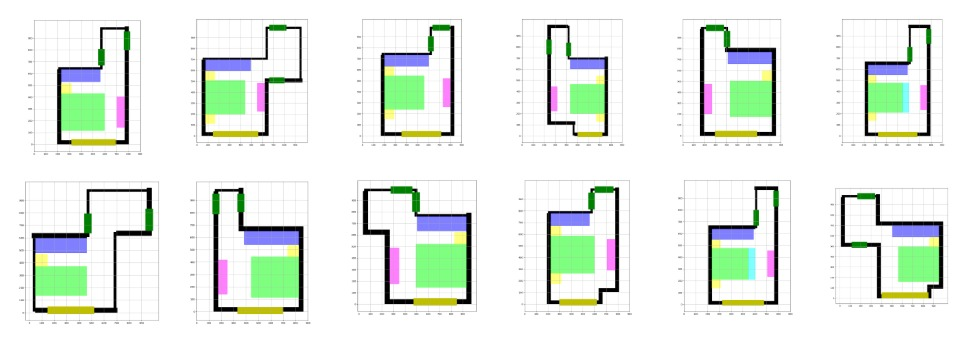

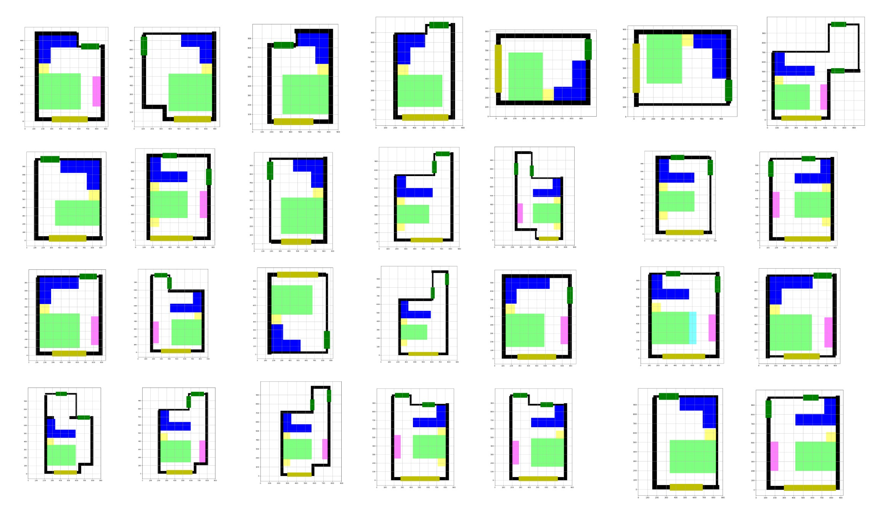

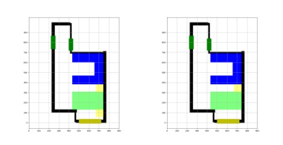

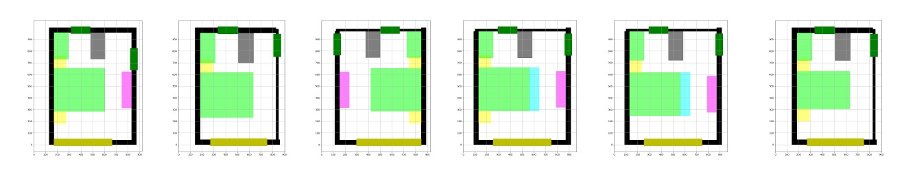

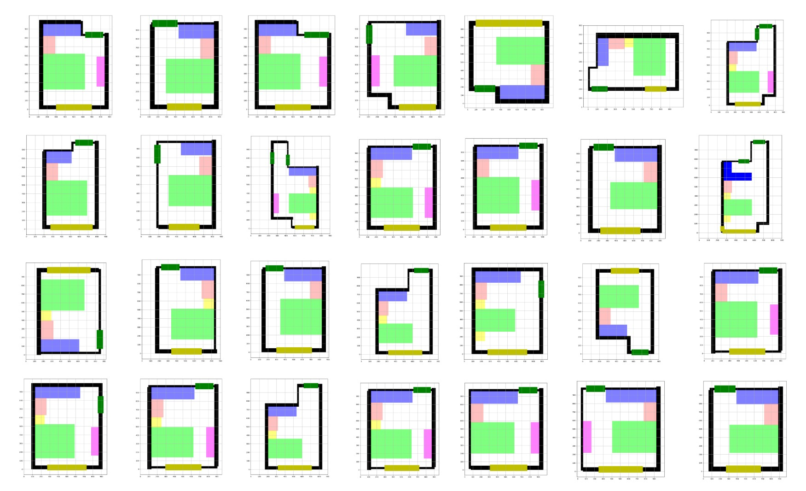

One model recommend 2 kinds of different furniture layout in a 2D simulation environment for the livingroom including the parallel and the vertical livingroom. The running time on a GPU is 0.2~0.3s.

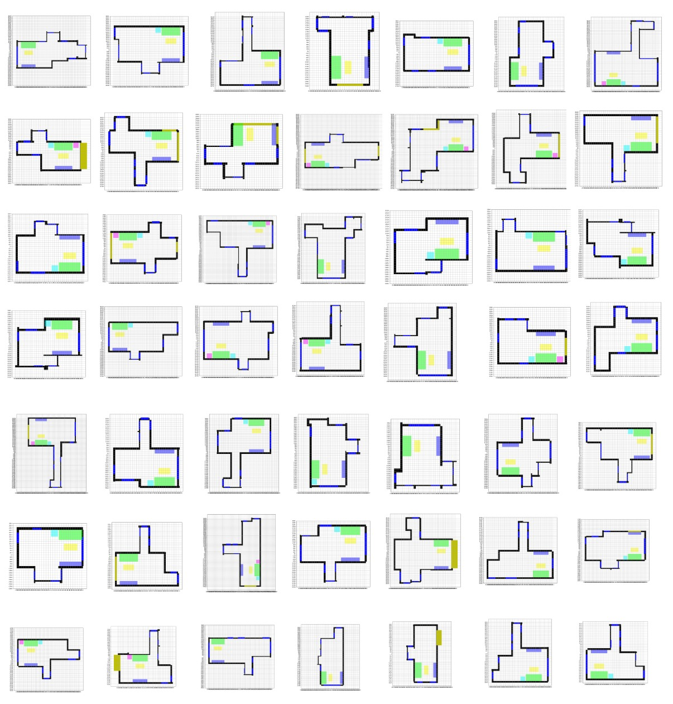

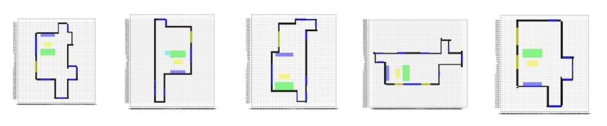

One model recommend 4 kinds of different furniture layout in a 2D simulation environemnt for the kitchen including the one-line, the L-line, the U-line and the two-lines. Both the area and 5 key cabinets(ice-box|cut|cook|middle|wash|) are predicted. The running time on a GPU is 0.2~0.3s.

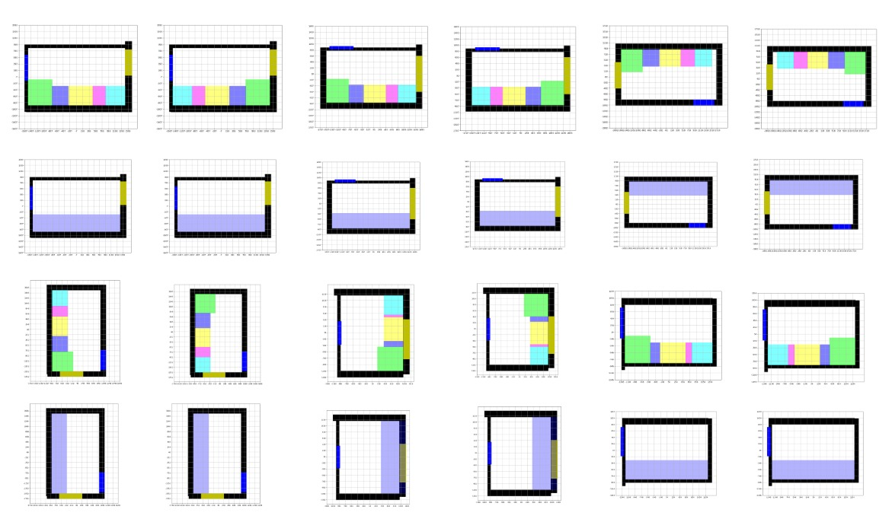
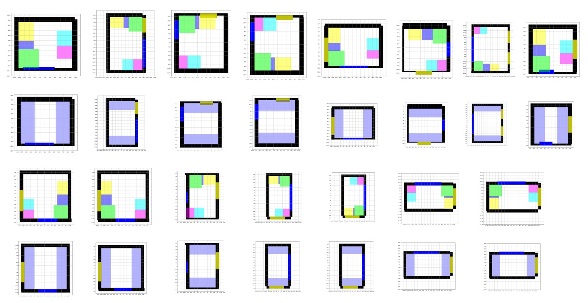
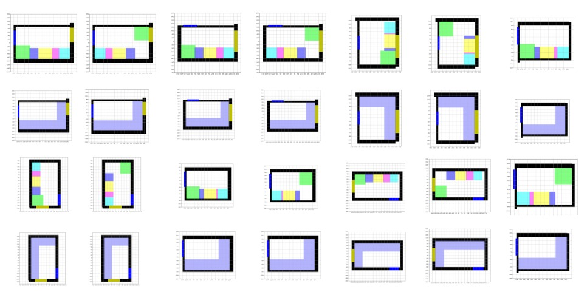
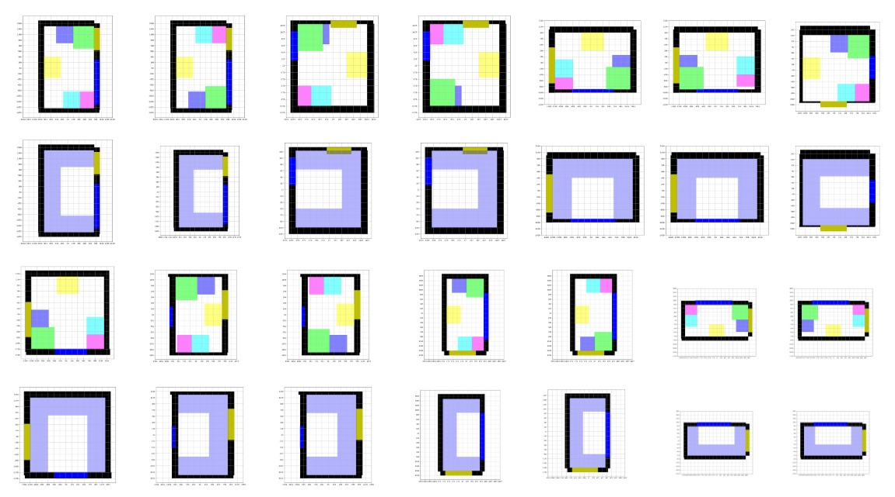

One model recommand 2 kinds of different funiture layout in a 2D simulation environment for the bathroom(main) including the square-type, the L-type. The layout of toliet, custom cabinet and square shower partition are predicted. As the guest bathroom is too simple, only simple, coding for some rules will cover it. There is no nedd to apply a deep model. 
The running time on a GPU is 0.2~0.3s.

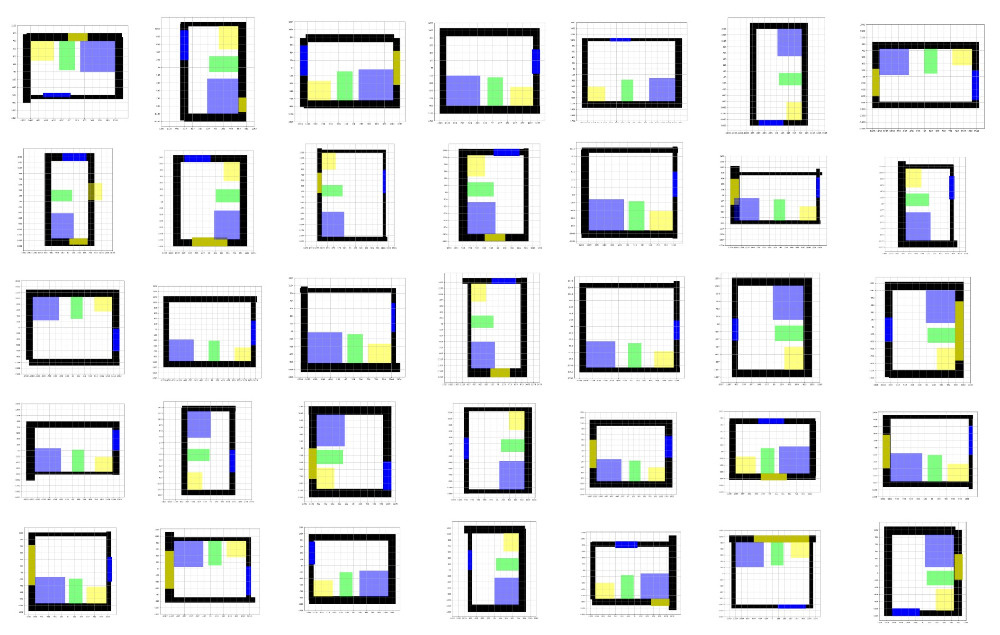
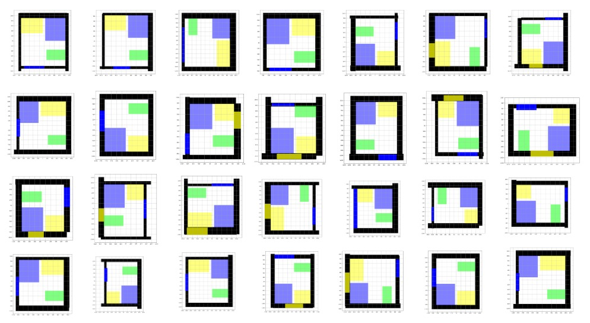

One model recommand 1 kind of different funiture layout in a 2D simulation environment for the tatami(main) such as the L-type. The layout of tatami-bed, custom cabinet, custom desk and chair are predicted. The running time on a GPU is 0.2~0.3s. It a typical sample for the whole custom room layout. Through two-stage deep cnn and graph model, the average error for the size of all furnitures (>7K layout samples) are under 0.1mm.

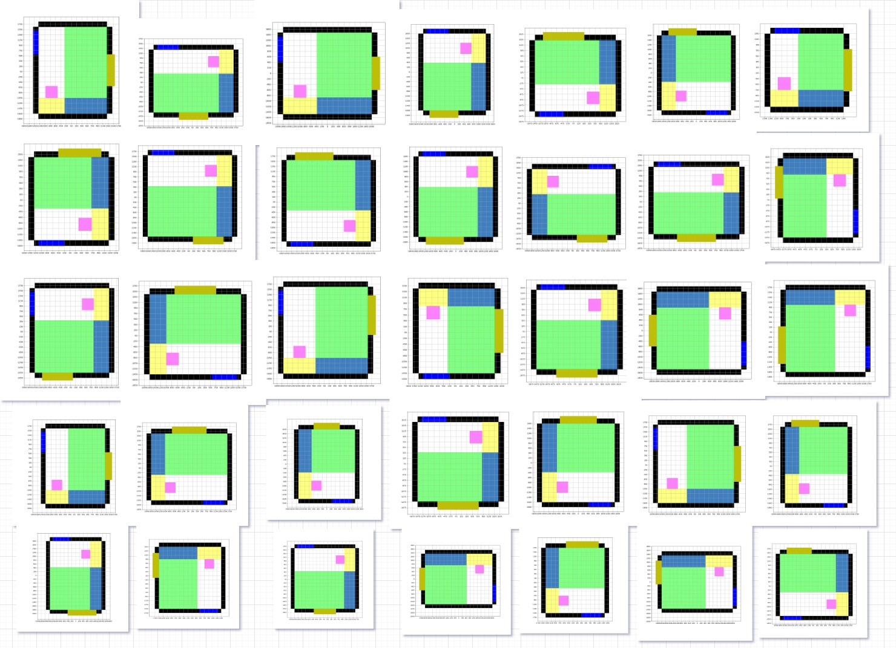

Tatami Layout and Study room recommendation will be predicted soon.

Please contact deepearthgo@gmail.com if have any questions.

